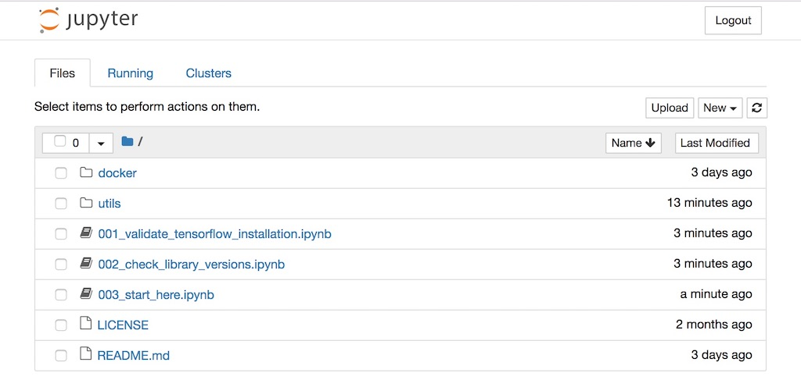
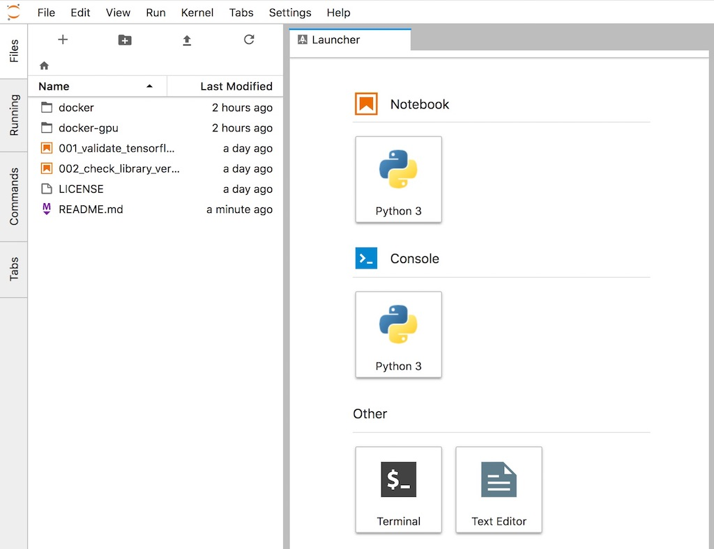

# A starter kit for Jupyter notebooks and machine learning



## Docker Images


To support both old and new environments, companion [docker images](https://hub.docker.com/r/wqael/notebooks/) are various combinations of
* [python](https://www.python.org/) versions (2.x and 3.x)
* machine learning frameworks ([Keras](https://keras.io/), [Tensorflow](https://www.tensorflow.org/), [PyTorch](https://pytorch.org/))
* [CUDA](https://developer.nvidia.com/cuda-zone)/[cuDNN](https://developer.nvidia.com/cudnn) versions (v9/v7 and v8/v6)

All of images include vision-centric libraries, such as
* [jupyter](http://jupyter.org/)
* [OpenCV](https://opencv.org/)
* [scikit-image](http://scikit-image.org/)
* [tensorBoardX](https://github.com/lanpa/tensorboard-pytorch) for [PyTorch](https://pytorch.org/)

Choose a CUDA version that matches the NVidia graphics driver version installed on your system. Here is a compatibility [chart](https://gist.github.com/rlan/258b7c030364735be10c9df277cff5ed).

## Tags

If you are reading this page from [Docker Hub](https://hub.docker.com/r/wqael/notebooks/), the links to Dockefiles will not work. Please go to the github [project page](https://github.com/rlan/notebooks) instead.

### [Conda](https://conda.io/miniconda.html)

| Tag   | Comment | Dockerfile | Info  |
| ----- | ------- | ---------- | ----  |
| `conda3-py3` | CPU-only | [Dockerfile](docker/conda3-py3/Dockerfile) | [ ](https://microbadger.com/images/wqael/notebooks:conda3-py3) |
| `conda2-py2` | CPU-only | [Dockerfile](docker/conda2-py2/Dockerfile) | [ ](https://microbadger.com/images/wqael/notebooks:conda2-py2) |
| `cuda9dnn7-conda3-py3` | | [Dockerfile](docker/cuda9dnn7-conda3-py3/Dockerfile) | [ ](https://microbadger.com/images/wqael/notebooks:cuda9dnn7-conda3-py3) |
| `cuda9dnn7-conda2-py2` | | [Dockerfile](docker/cuda9dnn7-conda2-py2/Dockerfile) | [ ](https://microbadger.com/images/wqael/notebooks:cuda9dnn7-conda2-py2) |
| `cuda8dnn6-conda3-py3` | | [Dockerfile](docker/cuda8dnn6-conda3-py3/Dockerfile) | [ ](https://microbadger.com/images/wqael/notebooks:cuda8dnn6-conda3-py3) |
| `cuda8dnn6-conda2-py2` | | [Dockerfile](docker/cuda8dnn6-conda2-py2/Dockerfile) | [ ](https://microbadger.com/images/wqael/notebooks:cuda8dnn6-conda2-py2) |


### [Caffe](https://caffe2.ai/)

| Tag   | Comment | Dockerfile | Info  |
| ----- | ------- | ---------- | ----  |
| `cuda8dnn7-py2-caffe2-detectron` | For Facebook's [Detectron](https://github.com/facebookresearch/Detectron) | [Dockerfile](docker/cuda8dnn7-py2-caffe2-detectron/Dockerfile) | [ ](https://microbadger.com/images/wqael/notebooks:cuda8dnn7-py2-caffe2-detectron) |

### [Keras](https://keras.io/) and [Tensorflow](https://www.tensorflow.org/)

| Tag   | Comment | Dockerfile | Info  |
| ----- | ------- | ---------- | ----  |
| `latest` | TF 1.10.0, AVX-FMA-SSE [1] | [Dockerfile](docker/latest/Dockerfile) | [ ](https://microbadger.com/images/wqael/notebooks:latest) |
| `mkldnn-py3-tf1.9.0-keras` | Intel MKL-DNN | [Dockerfile](docker/mkldnn-py3-tf1.9.0-keras/Dockerfile) | [ ](https://microbadger.com/images/wqael/notebooks:mkldnn-py3-tf1.9.0-keras) |
| `py3-tf1.10.1-keras` | CPU-only | [Dockerfile](docker/py3-tf1.10.1-keras/Dockerfile) | [ ](https://microbadger.com/images/wqael/notebooks:py3-tf1.10.1-keras) |
| `py3-tf1.9.0-keras` | CPU-only | [Dockerfile](docker/py3-tf1.9.0-keras/Dockerfile) | [ ](https://microbadger.com/images/wqael/notebooks:py3-tf1.9.0-keras) |
| `py3-tf1.8.0-keras` | CPU-only | [Dockerfile](docker/py3-tf1.8.0-keras/Dockerfile) | [ ](https://microbadger.com/images/wqael/notebooks:py3-tf1.8.0-keras) |
| `py3-tf1.4.1-keras` | CPU-only | [Dockerfile](docker/py3-tf1.4.1-keras/Dockerfile) | [ ](https://microbadger.com/images/wqael/notebooks:py3-tf1.4.1-keras) |
| `cuda9dnn7-py3-tf1.10.1-keras` | | [Dockerfile](docker/cuda9dnn7-py3-tf1.10.1-keras/Dockerfile) | [ ](https://microbadger.com/images/wqael/notebooks:cuda9dnn7-py3-tf1.10.1-keras) |
| `cuda9dnn7-py2-tf1.10.1-keras` | | [Dockerfile](docker/cuda9dnn7-py2-tf1.10.1-keras/Dockerfile) | [ ](https://microbadger.com/images/wqael/notebooks:cuda9dnn7-py2-tf1.10.1-keras) |
| `cuda9dnn7-py3-tf1.9.0-keras` | | [Dockerfile](docker/cuda9dnn7-py3-tf1.9.0-keras/Dockerfile) | [ ](https://microbadger.com/images/wqael/notebooks:cuda9dnn7-py3-tf1.9.0-keras) |
| `cuda9dnn7-py2-tf1.9.0-keras` | | [Dockerfile](docker/cuda9dnn7-py2-tf1.9.0-keras/Dockerfile) | [ ](https://microbadger.com/images/wqael/notebooks:cuda9dnn7-py2-tf1.9.0-keras) |
| `cuda9dnn7-py3-tf1.8.0-keras` | | [Dockerfile](docker/cuda9dnn7-py3-tf1.8.0-keras/Dockerfile) | [ ](https://microbadger.com/images/wqael/notebooks:cuda9dnn7-py3-tf1.8.0-keras) |
| `cuda9dnn7-py2-tf1.8.0-keras` | | [Dockerfile](docker/cuda9dnn7-py2-tf1.8.0-keras/Dockerfile) | [ ](https://microbadger.com/images/wqael/notebooks:cuda9dnn7-py2-tf1.8.0-keras) |
| `cuda8dnn6-py3-tf1.4.1-keras` | | [Dockerfile](docker/cuda8dnn6-py3-tf1.4.1-keras/Dockerfile) | [ ](https://microbadger.com/images/wqael/notebooks:cuda8dnn6-py3-tf1.4.1-keras) |
| `cuda8dnn6-py3-tf1.4.1-keras-tensorlayer` | | [Dockerfile](docker/cuda8dnn6-py3-tf1.4.1-keras-tensorlayer/Dockerfile) | [ ](https://microbadger.com/images/wqael/notebooks:cuda8dnn6-py3-tf1.4.1-keras-tensorlayer) |
| `cuda8dnn6-py2-tf1.4.1-keras` | | [Dockerfile](docker/cuda8dnn6-py2-tf1.4.1-keras/Dockerfile) | [ ](https://microbadger.com/images/wqael/notebooks:cuda8dnn6-py2-tf1.4.1-keras) |

[1] Custom Tensorflow build by [lakshayg](https://github.com/lakshayg/tensorflow-build).

### [PyTorch](https://pytorch.org/)

| Tag   | Comment | Dockerfile | Info  |
| ----- | ------- | ---------- | ----  |
| `conda3-py3-pytorch` | CPU-only | [Dockerfile](docker/conda3-py3-pytorch/Dockerfile) | [ ](https://microbadger.com/images/wqael/notebooks:conda3-py3-pytorch) |
| `conda2-py2-pytorch` | CPU-only | [Dockerfile](docker/conda2-py2-pytorch/Dockerfile) | [ ](https://microbadger.com/images/wqael/notebooks:conda2-py2-pytorch) |
| `cuda9dnn7-conda3-py3-pytorch` | | [Dockerfile](docker/cuda9dnn7-conda3-py3-pytorch/Dockerfile) | [ ](https://microbadger.com/images/wqael/notebooks:cuda9dnn7-conda3-py3-pytorch) |
| `cuda9dnn7-conda2-py2-pytorch` | | [Dockerfile](docker/cuda9dnn7-conda2-py2-pytorch/Dockerfile) | [ ](https://microbadger.com/images/wqael/notebooks:cuda9dnn7-conda2-py2-pytorch) |
| `cuda8dnn6-conda3-py3-pytorch` | | [Dockerfile](docker/cuda8dnn6-conda3-py3-pytorch/Dockerfile) | [ ](https://microbadger.com/images/wqael/notebooks:cuda8dnn6-conda3-py3-pytorch) |
| `cuda8dnn6-conda2-py2-pytorch` | | [Dockerfile](docker/cuda8dnn6-conda2-py2-pytorch/Dockerfile) | [ ](https://microbadger.com/images/wqael/notebooks:cuda8dnn6-conda2-py2-pytorch) |


## Usage

**Step 1**: pull pre-built images:

```sh
docker pull wqael/notebooks:<tag>
```

**Step 2**: launch image:

```sh
docker run -it -v $2:/notebooks -p 8888:8888 -p 6006:6006 $1
```

or, for GPU support

```sh
nvidia-docker run -it -v $2:/notebooks -p 8888:8888 -p 6006:6006 $1
```

where:

* `$1` is the tag for a docker image, e.g. `wqael/notebooks:latest`.
* `$2` is the folder containing the notebooks on the host file system, e.g. clone this repo and use `~/notebooks`.


**Step 3**: From the log, copy-and-paste the line similar to the following to your favorite browser:

```
    Copy/paste this URL into your browser when you connect for the first time,
    to login with a token:
        http://localhost:8888/?token=<token string>
```

**Bonus step**: Use next generation [Jupyter](http://jupyterlab.readthedocs.io/en/latest/):

After jupyter home page is loaded, i.e. `http://localhost:8888/tree`, browse to `http://localhost:8888/lab`.



**Step 4**: How to shutdown the docker image:

In the running image terminal, hit Ctrl+C **twice**.
